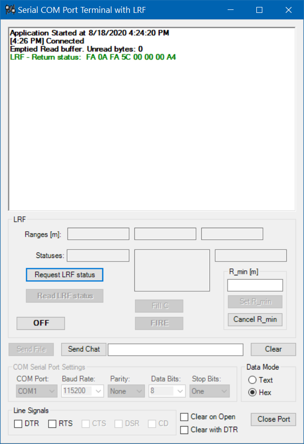

# lrf-sp  
 LRF (Laser Range Finder) controlled through Serial COM Port

### Keywords:

> LRF,	Laser Range Finder  
> Serial Port, COM  

  
  
  
  

### References
<a href="https://blogs.msmvps.com/coad/2005/03/23/serialport-rs-232-serial-com-port-in-c-net/">SerialPort (RS-232 Serial COM Port) in C# .NET</a>  
Documentation for <a href="https://docs.microsoft.com/en-us/dotnet/api/system.io.ports.serialport">SerialPort Class</a> from Assembly System.IO.Ports.dll 
